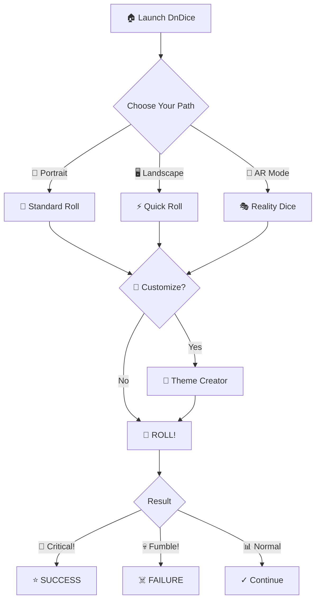

<div align="center">

# 🎲 DNDICE ⚔️

[](#)
[](#)
[](#)
[](#)
[](#)

*"Roll for initiative... in STYLE"* ⚔️


</div>

---

## ⚔️ **YOUR QUEST BEGINS HERE**

<div align="center">

<!-- 🖼️ COLOQUE A IMAGEM hero.png AQUI -->


</div>

**DnDice** não é só um app de dados. É uma **experiência imersiva** onde cada rolagem importa, cada tema conta uma história, e cada customização reflete seu estilo de jogo.

Construído com **Three.js** para física 3D realista, **RealityKit** para jogar dados na mesa REAL, e amor por **RPG de mesa**. 

> *"Some dice apps show numbers. DnDice shows your destiny."* 🎭

<!-- 🎬 COLOQUE O GIF dice-roll.gif AQUI (OPCIONAL) -->
<div align="center">


*Watch the D20 spin through the cosmic void...*
</div>

---

## 🎯 **CORE FEATURES**

<table>
<tr>
<td width="50%" align="center">

### 🎲 **DICE ARSENAL**


**Custom Dice**: 2-100 sides  
**Multiple Rolls**: Up to 20 dice at once  
**Roll Modes**: Normal | Blessed | Cursed  
**Proficiency Bonus**: -10 to +10

</td>
<td width="50%" align="center">

### 🎨 **INFINITE CUSTOMIZATION**


**Colors**: Every pixel, your choice  
**Textures**: 5 materials (metal, wood, stone...)  
**Fonts**: 11 typography options  
**Effects**: Glow, shadows, particles  
**Smart Contrast**: Auto-adapting text

</td>
</tr>
</table>

<div align="center">

### 📱 **ADAPTIVE INTERFACE** • 🌟 **AR MAGIC** • 🎵 **IMMERSIVE AUDIO**

</div>

---

## 🎪 **THE MAGIC IN ACTION**

<div align="center">

| 📱 **PORTRAIT MODE** | 🖥️ **LANDSCAPE MODE** |
|:---:|:---:|
| <!-- 🖼️ portrait.png -->  | <!-- 🖼️ landscape.png -->  |
| *Large dice view with intuitive controls* | *Quick-roll interface for fast gameplay* |

</div>

---

## 🎨 **THEMES SHOWCASE**

<div align="center">

<!-- 🖼️ COLOQUE A IMAGEM themes.png AQUI -->


### Choose Your Aesthetic ⚔️

| 🏰 **Classic D&D** | 🌲 **Medieval** | 🌆 **Cyberpunk** |
|:---:|:---:|:---:|
| Golden elegance | Wooden warmth | Neon madness |
| **🌑 Horror** | **⚡ Norse** | **✨ Arcane** |
| Cosmic dread | Viking power | Mystical glow |

**+ Light Mode for the brave souls who play in daylight** ☀️

</div>

---

## 🛠️ **FULL CUSTOMIZATION POWER**

<div align="center">

<!-- 🖼️ COLOQUE A IMAGEM customization.png AQUI -->


</div>

```swift
// 🎨 Change EVERYTHING
DiceTheme(
    diceFace: .crimson,        // The vessel
    diceBorder: .gold,         // The binding
    diceNumber: .silver,       // The fate
    background: .voidBlack,    // The cosmos
    accent: .arcaneBlue,       // The magic
    texture: .metallic,        // The material
    font: "Cinzel",           // The prophecy
    glow: 1.0,                // The power
    particles: true           // The enchantment
)
```

---

## 🌟 **AUGMENTED REALITY MODE**

<div align="center">

<!-- 🖼️ COLOQUE A IMAGEM ar-mode.png AQUI -->


### **THROW DICE INTO REALITY** 🎲✨

**Pokémon GO-style interface:**  
👉 Detect surfaces  
👉 Drag the D20  
👉 Release to throw  
👉 Watch physics magic happen  

*Powered by **RealityKit** • Realistic collision • Actual gravity*

</div>

---

## 🎲 **ROLL MODES & SPECIAL FEATURES**

<table>
<tr>
<td width="50%" align="center">

<!-- 🖼️ roll-modes.png -->


### ⚔️ **BLESSED MODE**
*Roll with advantage*

Roll **2 dice**, keep the **highest**  
Perfect for critical moments  
Green glow of fortune ✨

### 💀 **CURSED MODE**
*Roll with disadvantage*

Roll **2 dice**, keep the **lowest**  
When fate turns against you  
Red shadow of doom 🔥

</td>
<td width="50%" align="center">

<!-- 🖼️ multiple-dice.png -->


### 🎲 **MULTIPLE DICE**
*Roll up to 20 dice at once*

**Instant Stats:**
- 📊 Total (BIG number)
- 📈 Average
- 🔺 Max roll
- 🔻 Min roll

**Presets:** 2D6, 3D6, 4D6, 8D6...

</td>
</tr>
</table>

---

## 🎯 **TECH STACK**

<div align="center">


</div>

### 🏗️ **Architecture**

```
📱 SwiftUI + MVVM
├── 🎲 Three.js (r128) - 3D Physics Engine
├── 🌟 RealityKit - AR Rendering
├── 🎵 AVFoundation - Audio System
├── 🎨 Custom Contrast Engine (ITU-R BT.709)
└── 💾 UserDefaults + Core Data Ready
```

**12 Modular Components** • **Clean MVVM** • **Reactive with Combine**

---

## 🎮 **GAMEPLAY FLOW**



---

## 📱 **DEVICE COMPATIBILITY**

<div align="center">

| Device | Portrait | Landscape | AR | Status |
|:---:|:---:|:---:|:---:|:---:|
| 📱 iPhone 16 Pro | ✅ | ✅ | ✅ | **Perfect** |
| 📱 iPhone 15 | ✅ | ✅ | ✅ | **Perfect** |
| 📱 iPhone 14 | ✅ | ✅ | ✅ | **Perfect** |
| 📱 iPhone SE | ✅ | ✅ | ⚠️ | **Limited AR** |
| 📱 iPad | ✅ | ✅ | ✅ | **Optimized** |
| 💻 Mac Catalyst | ✅ | ✅ | ❌ | **Supported** |

</div>

---

## 🚀 **INSTALLATION**

### **Requirements**
```yaml
Platform: iOS 15.0+
Language: Swift 5.9
Framework: SwiftUI 4.0
AR: ARKit compatible device
Audio: AVFoundation
```

### **Quick Start**

```bash
# 1. Clone the legendary repository
git clone https://github.com/DalPra0/DnDice.git
cd DnDice

# 2. Open in Xcode
open Nano04DnDice.xcodeproj

# 3. Add required assets
# - Fonts in Resources/Fonts/
# - Audio in Resources/Audio/
# - D20.usdz in Resources/Models/

# 4. Build & Roll! (⌘ + R)
```

### 📂 **Project Structure**
```
Nano04DnDice/
├── 🎯 Views/              # 13 SwiftUI views
│   ├── DiceRollerView.swift
│   ├── DiceRollerLandscapeView.swift
│   ├── ThemesListView.swift
│   ├── ThemeCustomizerView.swift
│   ├── ARDiceView.swift
│   └── Components/        # 12 modular components
├── 🧠 ViewModels/         # MVVM business logic
├── 📊 Models/             # Data structures
├── ⚙️ Managers/           # Audio, Theme, AR, Shake
├── 🎨 Extensions/         # Color+Contrast, Color+Hex
└── 🎵 Resources/          # Fonts, Audio, 3D Models
```

---

## 🗺️ **ROADMAP**

### ✅ **PHASE 1-3: COMPLETE**
- [x] 🎲 Standard dice (D4-D20)
- [x] 🎨 7 preset themes
- [x] ✨ Full customization
- [x] 📱 Portrait/Landscape modes
- [x] 🤝 Shake to roll
- [x] 🌟 AR mode with RealityKit
- [x] ⚔️ Roll modes (Blessed/Cursed)
- [x] 🎵 Audio & haptic feedback
- [x] 📊 Multiple dice rolling
- [x] 🎭 Smart contrast system

### 🚧 **PHASE 4: IN PROGRESS**
- [ ] 📝 Session tracking
- [ ] 📋 Character sheet integration
- [ ] ⚡ Initiative tracker
- [ ] 📖 Roll history with context
- [ ] 🧮 Modifier calculator
- [ ] 📝 Campaign notes

### 🔮 **FUTURE DREAMS**
- [ ] ☁️ iCloud sync
- [ ] 👥 Multiplayer support
- [ ] 📱 Widget support
- [ ] ⌚ Apple Watch companion
- [ ] 🗣️ Siri shortcuts
- [ ] 🎒 Dice bag presets
- [ ] 📊 Statistics export
- [ ] 🌍 Community themes marketplace

---

## 🎨 **DESIGN PHILOSOPHY**

<div align="center">

### *"Elegance meets Functionality in the Realm of Chance"* ⚔️

</div>

```
🎯 PRINCIPLES:

1. DARK ELEGANCE
   └─ Deep blacks • Golden accents • Subtle shadows

2. TACTILE FEEDBACK
   └─ Every roll feels REAL • Haptics • Audio cues

3. ADAPTIVE INTELLIGENCE  
   └─ Smart contrast • Responsive layouts • Context-aware UI

4. IMMERSIVE EXPERIENCE
   └─ 3D physics • AR integration • Atmospheric audio
```

---

## 🤝 **CONTRIBUTING**

We welcome fellow adventurers! 🗡️

```bash
# Fork the realm
# Create your feature branch
git checkout -b feature/EpicFeature

# Commit your changes
git commit -m '✨ Add some EpicFeature'

# Push to the branch
git push origin feature/EpicFeature

# Open a Pull Request
```

### 📜 **Contribution Guidelines**
- ✅ Follow MVVM architecture
- ✅ Use SwiftUI best practices
- ✅ Comment in Portuguese (código em inglês)
- ✅ Test on multiple devices
- ✅ Keep components modular
- ✅ Add documentation for new features

---

## ⚖️ **LICENSE**

This project is licensed under the **MIT License** - see the [LICENSE](LICENSE) file.

```
Permission granted to:
✓ Use commercially
✓ Modify freely  
✓ Distribute widely
✓ Use privately

Conditions:
⚠️ Include copyright notice
⚠️ Include license text
```

---

## 🙏 **ACKNOWLEDGMENTS**

<div align="center">

**Standing on the shoulders of giants** 🏰


**Special thanks to:**
- The **RPG community** for endless inspiration
- **Gary Gygax & Dave Arneson** for D&D
- **Wizards of the Coast** for keeping the flame alive
- Every DM who ever said *"Roll for initiative"* ⚔️

</div>

---

## 📬 **CONTACT**

<div align="center">

**Lucas Dal Pra Brascher**

[](https://github.com/DalPra0)
[](mailto:your.email@example.com)

*Questions? Suggestions? Critical failures?*  
**Open an issue or send a raven** 🦅

</div>

---

<div align="center">

## 🎲 **ROLL THE DICE. SHAPE YOUR DESTINY.**

### ⭐ **Star this repo if you love rolling dice!** ⭐

---


---

### 🎭 **Made with ❤️ for the tabletop community**

*"May your rolls be high and your initiative higher"* ⚔️


**⚠️ WARNING: This app may cause addiction to rolling dice**  
**🎲 Side effects include: Perfect character creation, legendary loot, epic victories**

---

*Built with SwiftUI, powered by physics, blessed by the dice gods* 🎲✨  
*NanoChallenge 2025 • Where code meets critical rolls*

**"Natural 20 every time you open the app"** 🎯

[⬆️ Back to Top](#-dndice-)

</div>
